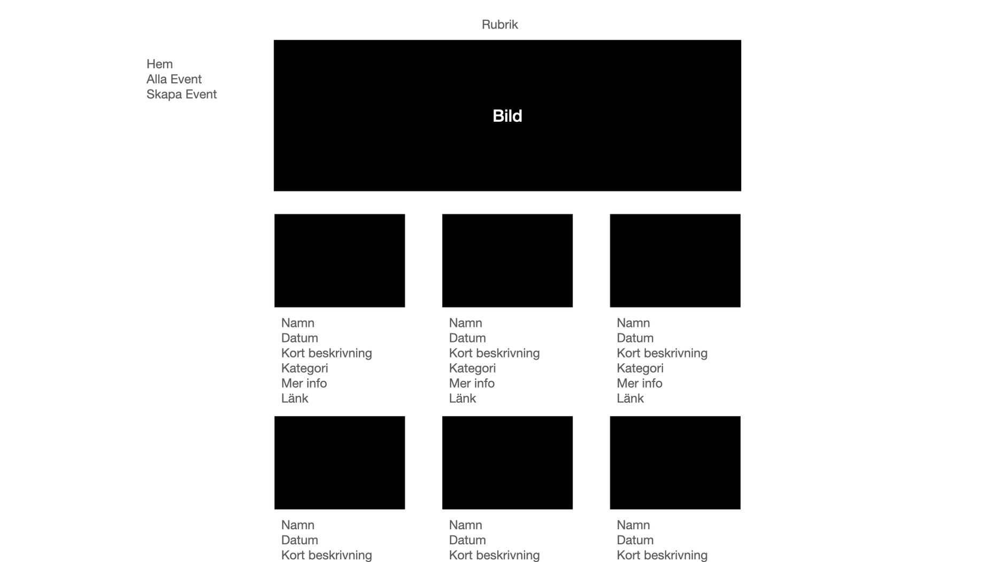
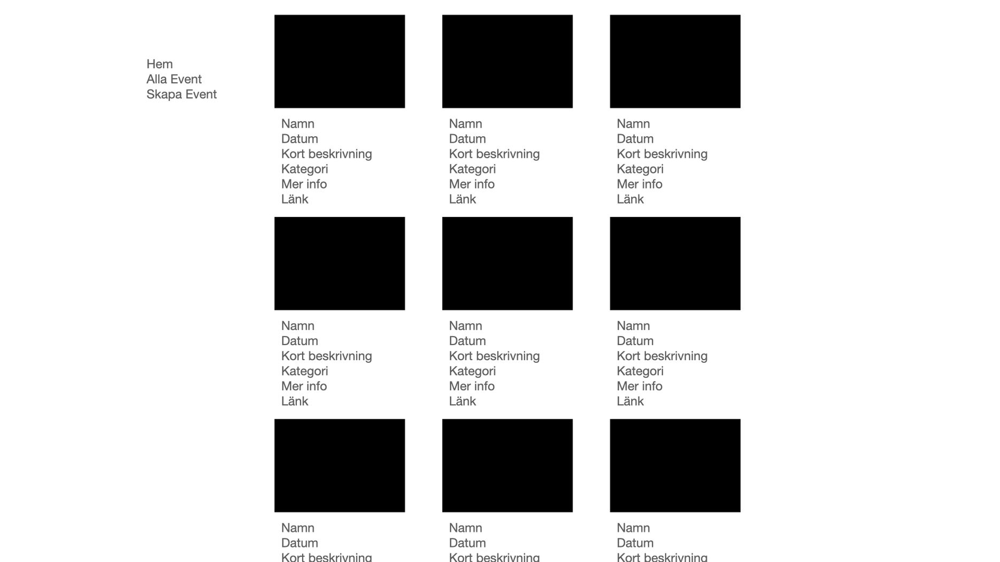
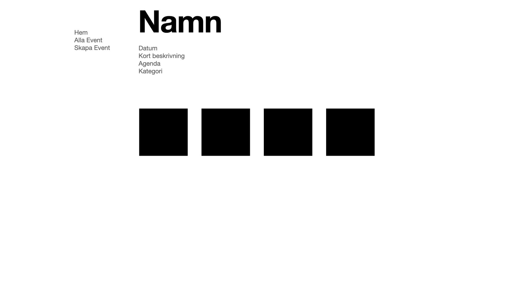
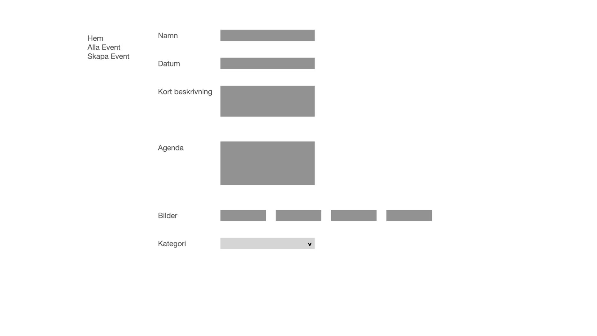
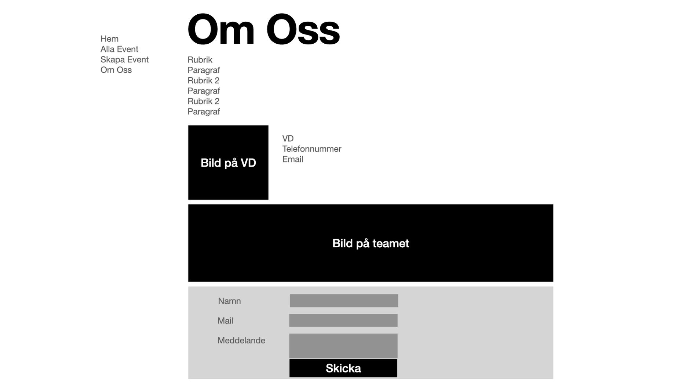

# HTML-CSS-Exam
Examination of the first course in HTML and CSS

# Individuell Inlämningsuppgift

För G krävs att man löser alla punkter nedan utom VG punkterna

För VG krävs att man löser alla G samt VG punkter.

För stock photos kan man använda sig utav [unsplash.com](http://unsplash.com) 

### Innehåll

- **Ni ska använda er utav scss**
### Landing Page: En förstasida med 6 utvalda event.
    - H1
    - En bild
    - Varje event i listvyn ska ha
        - Bild
        - Namn på eventet
        - Datum
        - Kort beskrivning
        - Kategori (antingen nöje, utbildning, afterwork).
        - VG: Mer info knapp
            - VG: När användaren trycker på denna knapp ska "kort beskrivning" dyka upp
        - Länk till detaljsida
        

 

### Event List Page: En sida som listar event.
    - Rubrik
    - Listvy med 10 event där varje event har
        - Bild
        - Namn på eventet
        - Datum
        - Kort beskrivning
        - Kategori (antingen nöje, utbildning, afterwork).
        - Länk till detaljsida

### Event Detail Page: Det ska finnas en detaljsida som visar detaljer för ett event:
    - Namn på event
    - Datum
    - Kort beskrivning
        - VG - utfällda beskrivningen från list sidorna
    - Agenda
    - 4 st bilder (när man för musen över en bild så ska den expandera med 10 px)
        - Glöm inte alt-taggar
    - Kategori (antingen nöje, utbildning, afterwork).
    - Det behöver inte finnas en detaljsida för varje event utan bara en exempelsida som kan vara densamma för alla event.

### Event Form: Det ska finnas ett administrationgränssnitt som låter en användare skapa ett event.
    - Endast formulär utan back-end koppling.
    - Formuläret ska innehålla
        - Namn på event
        - Datum
        - Kort beskrivning
        - Agenda
        - Plats för att ladda upp 4 bilder
        - Val av kategori (antingen nöje, utbildning, afterwork)
        - Submit knapp som inte måste göra något

### Det ska finnas en "Om oss"-sida.
    - "Om oss" sidan ska innehålla följande
        - Rubrik
        - Paragraf med information om företaget
        - Rubrik 2
        - Paragraf med info om teamet
        - Rubrik 2
        - Paragraf med info från VDn
        - Kontaktuppgifter till VDn
            - Telefonnummer (VG: ska gå att klicka på för att ringa Vdn)
            - Email (VG: ska gå att klicka på för att maila VDn)
            - Bild
        - Bild på teamet
        - Kontaktformulär (behöver inte ha back-end koppling)
            - Namn
            - Email
            - Meddelande
            - Submitknapp
                - VG: Tryck på knappen ska dölja formuläret och visa ett meddelande
                    - "Tack för ditt meddelande. Vi återkopplar så fort vi kan "

